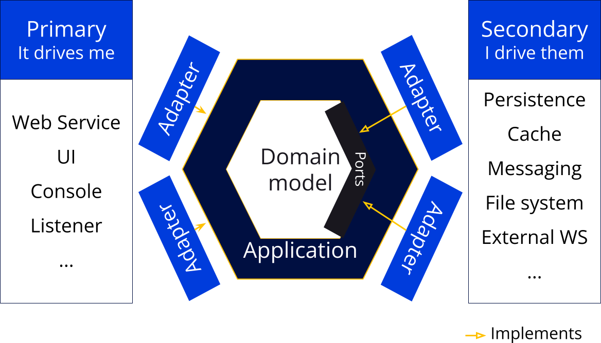
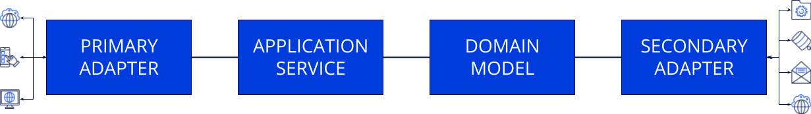

# Hexagonal architecture (application service flavor)

Good evening and welcome to this architecture documentation. Glad you made your way there! By the time of your reading this documentation may be outdated, feel free to update it!

So, this is basically about why and how to use a peculiar flavor of [hexagonal architecture](https://alistair.cockburn.us/hexagonal-architecture/).

**In a nutshell**, hexagonal architecture:

- Protects the domain model;
- Clearly separates business and infrastructure responsibilities.

## Disclaimers

- This documentation is a [JHipster Lite](https://github.com/jhipster/jhipster-lite) module. This **probably doesn't fit your exact needs, you'll have to adapt it!**;
- This is one of the many possible implementations of this architecture. If you are not comfortable with this one, just stick to one that helps you;
- Code architectures are here to help us build great software faster, if it's failing there is probably something to change.

## Goals

Here are some of the properties we are looking for when using this kind of architecture. Keeping them in mind while coding is really important!

### Built for changes

"The Only Constant in Life Is Change."- Heraclitus. This can't be more true in Software (hence [the name](https://en.wikipedia.org/wiki/Software)) and, if you have just a few weeks of experience, you know that "the users don't know what they want!!!". If the first quote is true, the second one is fallacious!

It's not that the users don't know what they want, in fact, nobody knows. Building a Software is not done with somebody telling the others what to do, it's done with [productive partnerships](https://manifesto.softwarecraftsmanship.org/). Yes, that means people will change their mind times and times again (and this is totally fine!).

So, as professional software developers we have to ensure that the code we are writing can welcome those changes. This often starts by lowering the solution complexity!

We often talk about three types of complexity:

- **Essential**: When building Software we have to solve a problem of complexity X: this is the essential complexity. This complexity directly relates to the problem we are trying to solve and we can't really make that lower.
- **Mandatory**: No matter the efforts, we are going to have to add some complexity to the system since we have technical stuff to do (persist data, send messages, ...). This complexity is called mandatory complexity.
- **Accidental**: On top of the two previous complexities comes the accidental complexity, the one we don't want because it's unnecessary. Example: if you have a configuration that is standing still for the past 10 years you probably don't need to put that in a database, handling that in code will be easier and more efficient (and no, you probably don't need microservices with one team of 3).

The hexagonal architecture allows us to reduce all those complexities to their bare minimum by giving clear responsibilities to each part of our Software.

The very clear Separation Of Concern enforced by the architecture eases automatic testing of each part since it's only doing one thing. Being able to build solid tests is also a great way to build a changes welcoming Software!

> Even if the architecture eases tests writing, being able to write good tests takes time and practice!

### Shorten feedback loops

In Software development if you want to go faster (like really faster) you'll have to go for short feedback loops. If you have a button that can tell you in a few seconds that your solution is still behaving as intended you'll be way faster than checking that by hand after any update (in fact, you won't check by hand that after any update...).

Let's be honest here: hexagonal architecture won't help for the fastest feedback loops which are pair feedback in [pair](https://en.wikipedia.org/wiki/Pair_programming) or [mob programming](https://en.wikipedia.org/wiki/Mob_programming).

BUT, just after that comes compilation and, for that, hexagonal architecture will help! Thanks to the very good Separation Of Concern you'll be able to build modules (packages in Java) with a very high cohesion and very low coupling. That means, most classes in the infrastructure modules will never get out of their hence allowing compilation time feedback.

There is another **AWESOME** compilation time feedback coming not directly from the architecture but from a practice often used in that architecture: Types Driven Development. The idea is pretty simple: create a dedicated type for each business concept. Example:

- `Firstname`: Yes, this is a `String` BUT this is not a phone number or a Klingon dictionary so create a type for that (with some checks and formatting).
- `Lastname`: Yep, another `String` BUT... same reasons.

With just those two you can totally fix lots of mistakes with `firstname` and `lastname` inversions in method parameters: if you send the wrong one it just won't compile!

In this CLI, domain/application code should expose business concepts through Value Objects instead of passing several raw values with business meaning. Primary adapters can still receive raw CLI or framework values, but they are responsible for translating those values into domain types before calling application services.

A Value Object can be a small record wrapping a raw value, such as a `String` or `Path`, when the raw value is the representation of a single concept. Give that type the validation, normalization, and naming that belong to the concept. Avoid domain aggregate records with multiple raw components like `String id, String version` when those components can be named and protected as domain types.

Then, a little bit slower than compilation, comes automated tests. As seen earlier this architecture eases testing so you'll be able to get fast (counting in seconds here) and reliable feedback from tests.

We said earlier that pairs feedbacks were the fastest ones but what about business experts feedback? Using "classic" (Controller, Service, Repository) architecture we have to build a whole "thing" to hope for a business expert feedback. Here, the Domain Model code is so close to the business that it's really easy to sit at a screen with a business expert and to get feedback from that! Of course, you'll probably have to explain some "coding stuff" BUT you will be able to get feedback from the business expert on any given piece of algorithm really early!

### Delay infrastructure choices

It's common to start a project with meetings to "build the architecture" which, in that case, means choosing the infrastructure elements. So, on day 0, we are trying to figure out if we need a MongoDB, a PostgreSQL or both (and what about an Elasticsearch?).

Problem is: we often make these choices without enough information and we'll just make our best guesses (since the real needs will come from the code). The other problem is that we spend a lot of time doing that. Another option would be to pick only one thing: the language (do we go Java?). Picking the language can be challenging enough, but it's easier than picking a gazillion technologies along with the language.

The hexagonal architecture allows us to start as soon as we know the language. From that, we'll be able to start building a solution and have the real infrastructure needs appear from the code. Of course, we'll have to pick a structuring framework soon enough (Spring, Quarkus, ...) but we can delay the persistence choice for quite some time!

Delaying choices allows:

- Better choices. Even if you say "we'll change if it needs to" you'll have to fight against [the sunk cost fallacy](https://thedecisionlab.com/biases/the-sunk-cost-fallacy);
- Faster first loops (since you remove big parts of the mandatory complexity from the bootstrap).

## Where to put code

Finally, the architecture part you were looking for :P.

So, first things first: **an application is made of multiple "hexagons"**, one for each [Bounded Context](https://martinfowler.com/bliki/BoundedContext.html). (Yes, sometimes you can have only one but this is an exception). We usually have each Bounded Context as root packages in the application.

Originally, this architecture was presented in a hexagon (hence the name) with the Domain Model at its center:



In this flavor, the calls flow is as follows:



We can enforce this architecture with this folder organization:

- `my_business_context`: root package for the context (naming depends on your technology naming conventions)
  - `application`: contains the application layer code
  - `domain`: contains the business code
  - `infrastructure`:
    - `primary`: contains adapters implementations that drives your context
    - `secondary`: contains adapters implementations that your context drives

As said many times, each "part" here has a specific concern so let's follow the rabbit in that hole.

### Code in Domain Model

This is the code that really matters. You can build it using [Domain Driven Design](https://en.wikipedia.org/wiki/Domain-driven_design) building blocks or any other tool that will help you build a clear representation of the business.

This model doesn't depend on anything, and everything depends on it so it is totally framework-agnostic, you just need to pick a language to build your Domain Model.

Apart from the code used to make the business operations we'll find ports in the Domain Model. Ports are `interfaces` that are used to invert dependencies. As the Domain Model sometimes needs ports for some operations, they can only be there since the Domain doesn't depend on anything.

A port belongs in the Domain Model only when domain or application behavior actually needs that capability. An interface implemented by secondary infrastructure but only consumed by other secondary infrastructure, composition wiring, or tests is not a domain port. Keep those adapter-internal seams in `infrastructure.secondary`, because putting them in `domain` makes technical layout and adapter design look like business language.

### Code in Application

The application layer **MUST NOT CONTAIN ANY BUSINESS RULE**, its responsibilities are:

- Basic orchestration:
  - Get something from a port;
  - Make an operation on that thing (call a method on the object);
  - Save that thing using a port;
  - Dispatch created events using a port.
- Transactions management;
- Authorization check (this is the wiring point, the business for authorization must be in the domain).

### Code in Primary

The primary part contains adapters for the code driving our domain. Example: code to expose REST WebServices. This part depends a lot on frameworks and is responsible for making the best possible exposure of the business actions.

### Code in Secondary

The secondary part is made of adapters implementing the ports from the domain. This part depends a lot on frameworks and its responsibility is to make the best possible use of the infrastructure our business needs.

Secondary infrastructure can also define its own technical interfaces when it needs local seams for process execution, filesystem variants, framework wrappers, or deterministic tests. Those interfaces are not ports unless domain or application code depends on them.

A secondary adapter must not call its own bounded context's application layer. It may integrate an external bounded context through that context's public application API when the external API is the mechanism behind a domain capability. In a Spring runtime, make these adapters ordinary components with constructor injection. Reserve explicit `composition` packages for manual wiring that must happen before Spring exists, such as bootstrap selection; do not add them for application flows already created inside the Spring context.

### Module-set planning and execution flow

The executable `apply-set` command is a concrete example of these boundaries. `ApplyModuleSetCommand` is the primary
Picocli adapter. It creates global options before parsing, lets Picocli produce their declared value types, translates raw
slugs, project path, commit selection, property keys, and values into domain types, then renders the plan, warnings,
progress, summary, streams, and exit codes. No interface wording or formatting enters domain or application code.

`ModuleSetPlanningApplicationService` orchestrates a read-only request and produces an immutable `ModuleSetPlan`. That
snapshot contains the exact landscape order, application/reapplication annotations, dependency facts, resolved parameter
explanations, one effective map containing only explicit and compatible history values, commit mode, problems, and
warnings. It also records whether detailed dependency and parameter planning was `EVALUATED` or `NOT_EVALUATED`, so empty
evaluated results cannot be confused with stages skipped after an early validation problem. It is the sole input accepted
by `ModuleSetExecutionApplicationService`; execution never reads the catalog or history and never recalculates order or
parameters.

Planning depends on four domain capabilities. The `ModuleSetCatalog` contract is stable for the lifetime of its planner;
resources, landscape, and extensions are assembled before the Picocli tree, and the process executes one command without
catalog hot reload:

- `ModuleSetCatalog` exposes visible module metadata and deterministic landscape ordering;
- `ModuleSetPlanningHistoryReader` exposes applied modules and latest parameter facts through the Seed4J public history
  API;
- `ModuleSetProjectPathValidator` reports whether the user-visible destination is valid or apparently creatable without a
  write probe; and
- `ModuleSetGitStateReader` reports `NO_WORKTREE`, `CLEAN`, or `DIRTY` without exposing JGit types.

Their secondary implementations are `Seed4JModuleSetCatalog`, `ProjectsModuleSetPlanningHistoryReader`,
`NioModuleSetProjectPathValidator`, and `JGitModuleSetGitStateReader`. The NIO adapter owns filesystem metadata checks, and
the JGit adapter owns repository discovery and tracked, staged, and untracked status inspection. Neither adapter leaks
storage layouts or framework representations into the plan.

`Seed4JModuleSetCatalog` also owns the external-metadata consistency boundary for property types. After mapping every
visible Seed4J resource into domain definitions, it verifies that each global property key has one type across the entire
catalog. Divergent external resources fail deterministically as an internal adapter inconsistency before the primary
adapter can expose Picocli options. The domain reconciler remains defensive for other `ModuleSetCatalog` implementations:
selected type conflicts produce structured invalid-preflight facts without choosing an arbitrary definition.
An explicit domain value incompatible with its reconciled property type instead violates an internal invariant. The
planner throws a dedicated domain exception before parameter resolution rather than exposing an unreachable preflight
problem or CLI diagnostic.

Execution depends only on `ModuleSetModuleApplier`. `Seed4JModuleSetModuleApplier` converts each planned item, project
path, commit mode, and the unchanged complete effective parameter map into `Seed4JModuleToApply`, then calls the existing
individual `Seed4JModulesApplicationService.apply(...)` API. The CLI does not use the core multi-module API and does not
duplicate file generation, history persistence, Git initialization/commit, or event dispatch behavior.

`ModuleSetExecutionApplicationService` visits the approved order sequentially and publishes typed start/completion events.
On the first thrown individual call, it preserves preceding successes, marks the current item `FAILED`, marks every later
item `SKIPPED`, and returns a complete `PARTIAL_FAILURE` result without rollback.

The resulting dependency direction is:

```text
Picocli ApplyModuleSetCommand
  -> ModuleSetPlanningApplicationService
    -> ModuleSetCatalog / ModuleSetPlanningHistoryReader
    -> ModuleSetProjectPathValidator / ModuleSetGitStateReader
      <- Seed4J / Projects / NIO / JGit secondary adapters
  -> ModuleSetExecutionApplicationService
    -> ModuleSetModuleApplier
      <- Seed4JModuleSetModuleApplier -> individual Seed4J apply API
```

This split makes the mutation boundary explicit: planning reads external state and returns facts; only execution invokes
the mutating capability, and it does so using the same approved plan instance.
